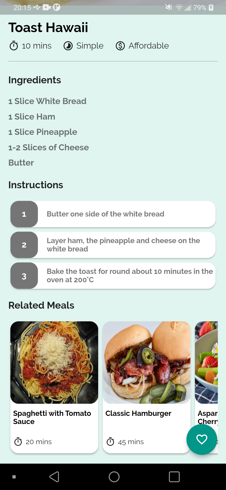

# Flutter Recipe App

## Getting Started

### Core functions:
 - Show the recipe's categories, recipes, recipe details & related recipes
 - Add favorite recipes
 - Filter recipes

### Demo

#### 1:

    
    
    

#### 2:

    
    
    

